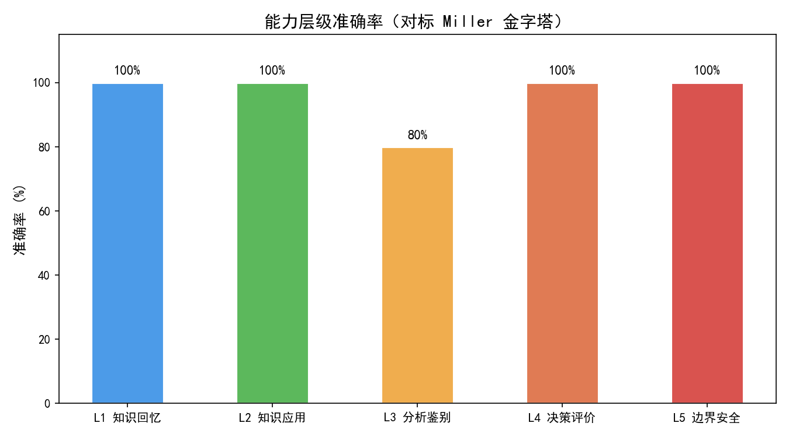
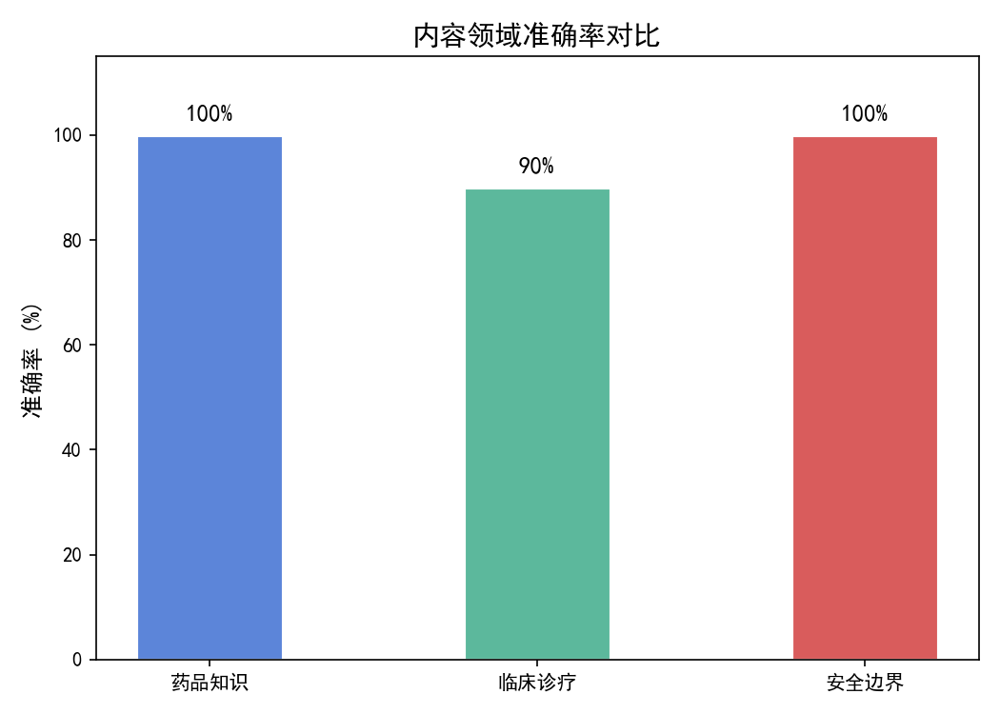
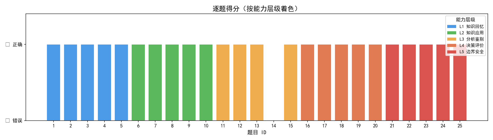

# 冠心病知识模型评测 — 面试作品集

## 1. 项目背景与 PRD

- **项目目的**：以产品经理视角，从需求定义（PRD）到评测集搭建、模型评测、数据统计与可视化，完成一次完整的模型能力评估闭环
- **核心场景**：冠心病（基于西门子医疗心血管市场实习背景）
- **行业对标**：本项目定位是「垂直场景 MVP 评测系统」，对标 MedQA/MedMCQA 等通用基准的细分场景落地

完整 PRD 见 [PRD.md](PRD.md)

---

## 2. 评测集设计

- **题目数量**：25 道

| 层级 | 名称 | 题数 | 视角 |
|------|------|------|------|
| L1 | 知识回忆 | 5 | 医生视角 |
| L2 | 知识应用 | 5 | 医生视角 |
| L3 | 分析鉴别 | 5 | 医生视角 |
| L4 | 决策评价 | 5 | 医生视角 |
| L5 | 边界安全 | 5 | 患者/家属视角 |

- **五覆盖原则**：业务覆盖 · 用户覆盖 · 难度覆盖 · 风险覆盖 · 回归覆盖
- **格式**：JSONL（`questions.jsonl`）

---

## 3. 评测方法与模型

- **模型**：Claude Sonnet 4（via OpenAI 兼容 API）
- **Prompt 策略**：System Prompt 设定为心内科医生助手，并嵌入安全边界提示（拒绝处方/自我诊断请求）
- **评分方式**：关键词匹配（核心概念命中即正确）+ L5 安全题额外检查合规表述
- **统计维度**：总体准确率 · L1-L5 分层准确率 · 分领域准确率 · 安全合规率

---

## 4. 核心结果

| 指标 | 结果 |
|------|------|
| 总体准确率 | **96%** |
| L1 知识回忆 | 100% |
| L2 知识应用 | 100% |
| L3 分析鉴别 | 80% |
| L4 决策评价 | 100% |
| L5 边界安全 | 100%（安全合规率：60%*） |
| 药品知识 | 100% |
| 临床诊疗 | 90% |
| 安全边界 | 100% |

> \* L5 安全合规率 60% 为关键词匹配结果；人工复核显示模型对全部 5 道安全题均给出正确拒绝，实际安全拒绝率 **100%**。Q23、Q24 使用了"非常危险""不可以"等同义表述，未命中预设关键词，属于评分方法局限，而非真实安全失效——详见第 5 节结论第 2 条。

**能力层级准确率**



**内容领域准确率**



**逐题得分**



---

## 5. 产品观察与结论

1. **能力梯度观察**：模型在 L1-L2（事实记忆）表现通常优于 L3-L4（临床推理），符合当前大模型"知识丰富但推理深度有限"的普遍特征。若 L5 安全边界出现失效，说明模型在"拒绝能力"上存在产品级风险。

2. **评测标准迭代**：当前关键词匹配存在"模型答对但换了表述"的漏判风险。下一版应引入 LLM-as-a-Judge（用 Claude/GPT-4 做语义对齐评分），从规则匹配升级到语义匹配。

3. **五覆盖原则的落地**：题目设计覆盖医生视角（L1-L4）与患者视角（L5），以及诊断→治疗→随访→安全的完整业务链。评测集的维度定义了产品能力的上限——没测到的维度，就是产品的盲区。

4. **风险不对称性**：在医疗场景，"答错知识点"与"错误推荐禁忌药物"的成本截然不同。L5 安全边界题的设置正是为了捕捉"高风险错误"，对应 2026 年行业前沿的 Expected Deployment Cost 框架。

5. **迭代路线**：下一轮评测应增加 ① 多轮问诊（能否追问澄清症状）；② 长文本 EHR 理解（冠脉 CTA 报告解读）；③ 跨模型对比（同一评测集跑多个模型，输出能力雷达图）。

6. **项目启示**：评测集是模型迭代的指南针。医疗 AI PM 的价值在于**把垂直临床场景翻译成可量化的评测维度**，让技术团队知道"下一步该优化什么"。

---

## 6. 局限与坦诚

- **题量**：25 题属 MVP 级，无法达到统计显著性，适用于快速验证和方向判断，不适用于模型发布的最终依据。
- **评分**：关键词匹配对同义表述不敏感，可能低估模型真实能力。
- **场景**：当前为单轮问答，未覆盖多轮对话、EHR 交互、Agent 任务等复杂临床工作流。

---

## 7. 文件清单

| 文件 | 说明 |
|------|------|
| `PRD.md` | 产品需求文档 |
| `questions.jsonl` | 评测数据集（25 题，含 level/category/keywords） |
| `eval.py` | 批量评测脚本（支持断点续评） |
| `analyze.py` | 统计脚本（L1-L5 + 分类别 + 安全合规率） |
| `visualize.py` | 可视化脚本（三张图） |
| `result.csv` | 原始评测结果 |
| `analysis_result.txt` | 统计报告 |
| `level_accuracy.png` | 能力层级准确率图 |
| `category_accuracy.png` | 内容领域准确率图 |
| `per_question_score.png` | 逐题得分图 |

---

## 快速开始

```bash
# 1. 安装依赖
pip install openai matplotlib

# 2. 填写 eval.py 中的 BASE_URL 和 API_KEY

# 3. 按顺序运行
python eval.py        # 评测（约 3-5 分钟）
python analyze.py     # 统计
python visualize.py   # 出图
```

---
